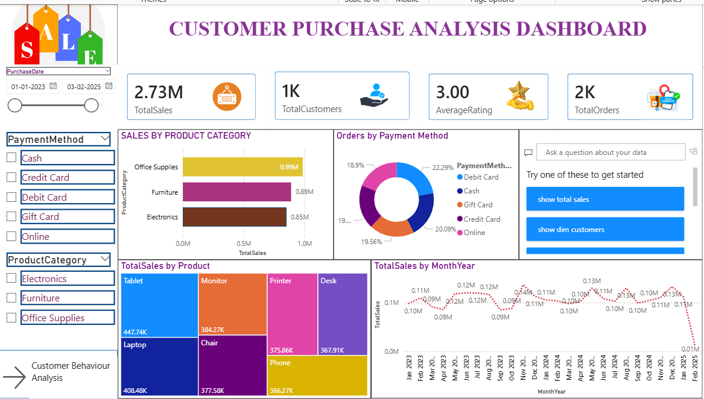
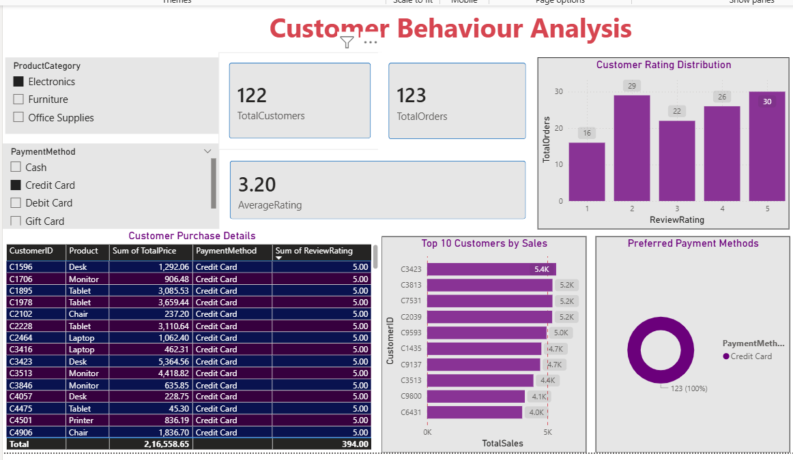

# 📊 Customer Purchase Analysis Dashboard | Power BI

## 📌 Project Overview

This project presents an interactive **Customer Purchase Analysis Dashboard** built using **Microsoft Power BI**. The dashboard provides insights into customer purchasing behavior, product performance, payment methods, sales trends, and customer behavior to support data-driven business decisions.

The report consists of **two interactive dashboard pages**:
1. **Customer Purchase Analysis Dashboard**
2. **Customer Behaviour Analysis Dashboard**

---

## 🎯 Project Objectives

- Analyze customer purchase history.
- Monitor overall sales performance.
- Identify top-selling products.
- Analyze customer purchasing behavior.
- Analyze payment method preferences.
- Track monthly sales trends.
- Identify top customers by sales.
- Build an interactive dashboard using Power BI.

---

## 🛠 Tools & Technologies

- Microsoft Power BI
- Power Query
- DAX (Data Analysis Expressions)
- Microsoft Excel
- Data Modeling (Star Schema)

---

## 📂 Dataset Information

The dataset contains customer purchase records with the following fields:

- Customer ID
- Customer Name
- Product
- Product Category
- Purchase Date
- Quantity
- Unit Price
- Total Price
- Payment Method
- Review Rating

---

# 📄 Dashboard Pages

## 📊 Page 1 – Customer Purchase Analysis Dashboard

This dashboard provides an executive overview of sales performance and product insights.

### Features

### KPI Cards
- Total Sales
- Total Customers
- Total Orders
- Average Customer Rating

### Interactive Visualizations
- Sales by Product Category
- Monthly Sales Trend
- Orders by Payment Method
- Product-wise Sales (Treemap)

### Filters (Slicers)
- Purchase Date
- Payment Method
- Product Category

---

## 👥 Page 2 – Customer Behaviour Analysis Dashboard

This dashboard focuses on customer purchasing behavior and customer performance.

### Features

### KPI Cards
- Total Customers
- Total Orders
- Average Customer Rating

### Interactive Visualizations
- Top 10 Customers by Sales
- Customer Rating Distribution
- Preferred Payment Methods
- Customer Purchase Details (Matrix Table)

### Filters (Slicers)
- Product Category
- Payment Method

---

## 📊 Power BI Concepts Used

- Data Cleaning using Power Query
- Data Transformation
- Data Modeling (Star Schema)
- One-to-Many Relationships
- DAX Measures
- Interactive Slicers
- KPI Cards
- Matrix Table
- Clustered Bar Chart
- Donut Chart
- Treemap
- Line Chart
- Data Visualization
- Dashboard Design

## 📌 Key Insights

- Electronics generated the highest sales among all product categories.
- Credit Card was one of the most preferred payment methods.
- The Top 10 customers contributed significantly to overall sales.
- Customer ratings were generally positive, indicating good customer satisfaction.
- Monthly sales trends help identify seasonal business performance.
- Interactive slicers allow dynamic analysis based on product category and payment method.

---

## 📊 Data Model

This project follows a **Star Schema** data model.

### Fact Table
- Customer Purchase History

### Dimension Tables
- Date Table
- Customer Table
- Product Table

Relationships:
- One-to-Many (1:*)
- Single Direction Filtering

---

## 📈 DAX Measures

The following measures were created using DAX:

- Total Sales
- Total Customers
- Total Orders
- Average Customer Rating
---
## 📸 Dashboard Preview

### Page 1 – Customer Purchase Analysis Dashboard

### Page 2 – Customer Behaviour Analysis Dashboard

## 👨‍💻 Author

** Sapna Gupta**

Aspiring Data Analyst

### Skills

- Power BI
- SQL
- Python
- Excel
- Tableau
- Power Query
- DAX
- Data Visualization
- Data Modeling

### Connect With Me

**LinkedIn:** *(https://www.linkedin.com/in/sapna-gupta-/)*

